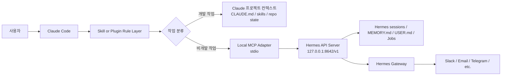
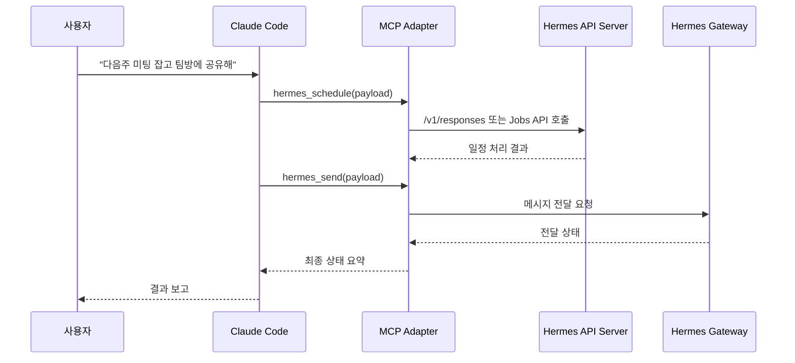

# Claude에서 Hermes로 단방향 위임하기 위한 구현 기획서

## 요약

기준일은 2026-06-04 KST다. 공식 문서만 놓고 보면, **가장 빠른 MVP**는 Claude Code에서 로컬 stdio MCP로 `hermes mcp serve`를 붙이는 방식이다. 다만 이 경로가 노출하는 공식 도구는 `conversations_list`, `messages_read`, `messages_send`, `events_poll`, `permissions_respond` 등 **메시징 브리지 중심 10개 도구**이며, 읽기 작업은 게이트웨이 없이도 가능하지만 **실제 전송은 Hermes gateway가 살아 있어야만 동작**한다. 즉, 이 방식은 “문의함 읽기/답장 보내기”에는 적합하지만, 사용자가 원하는 **비개발 메모·일정·업무 위임 전체**를 `hermes mcp serve`만으로 해결하기에는 표면이 좁다. citeturn5view0turn4view8

따라서 **권장 목표 아키텍처**는 다음이다. Claude Code 쪽에는 **로컬 stdio 기반의 얇은 커스텀 MCP 어댑터**를 두고, 그 어댑터가 Hermes의 **로컬 API server**와 **gateway**를 호출하도록 만든다. Hermes API server는 OpenAI 호환 `/v1/chat/completions`, `/v1/responses`, `/v1/runs`, `/v1/skills`, `/v1/toolsets`, Jobs API를 제공하며, 공식 문서상 **full toolset, memory, skills**를 가진 서버 런타임이다. 이 방식이면 Claude가 직접 Hermes 내부 전체 도구를 보는 대신, `inquiry`, `schedule`, `memo`, `send` 같은 **정제된 4개 도메인 도구**만 보게 할 수 있다. 역할 경계와 데이터 경계가 훨씬 명확해진다. citeturn13view0turn12search2

전송 방식은 **Claude Code에서는 stdio 우선**, **원격/클라우드/API 통합에서는 HTTP 보조**가 맞다. Claude Code는 로컬 stdio, HTTP, WebSocket MCP를 지원하고, 사용자/프로젝트/플러그인 스코프까지 제공한다. 반면 Claude API의 MCP connector는 **public HTTPS 원격 MCP 서버만 지원**하고, **local stdio는 직접 연결할 수 없으며**, 기능도 현재는 **tool calls 중심**이다. 그래서 이번 범위처럼 **개인 비서·팀 비서용 로컬 보조 도구**는 Claude Code + stdio가 기본값이다. HTTP 어댑터는 “Claude API나 원격 서비스에서도 같은 브리지를 써야 할 때”만 고려하는 것이 맞다. citeturn7view0turn7view1turn7view2turn8view0

보안 측면에서 핵심은 단순하다. Hermes API server는 **127.0.0.1 바인딩 + 필수 `API_SERVER_KEY`**를 기본 원칙으로 두고, gateway는 **allowlist + DM pairing**을 켜며, Hermes의 terminal backend는 **docker**를 권장한다. Hermes 공식 보안 문서는 production gateway에 Docker/Modal/Daytona 같은 격리 백엔드를 권장하고, MCP subprocess에는 **안전한 환경변수만 전달**하며, gateway는 기본적으로 **allowlist 또는 pairing이 없는 사용자를 모두 거부**한다. 공개 GitHub 이슈에는 API server를 네트워크에 노출할 때 인증 누락이 치명적일 수 있다는 사례도 있다. citeturn25view0turn5view3turn4view5turn24view0turn28view2

운영 결론도 명확하다. **로컬 개인용/소규모 팀**이면 “프로젝트 `.mcp.json` 또는 사용자 스코프 + 로컬 stdio 어댑터 + Hermes local API server + gateway”가 가장 현실적이다. 반대로 **엔터프라이즈 managed policy** 환경에서는 플러그인 번들 `.mcp.json`이 `allowedMcpServers`와 충돌하거나, 플러그인 서버명이 allowlist에 맞지 않아 막히는 이슈가 2026년 GitHub에 보고되었고 두 건 모두 **closed as not planned** 상태다. 그런 환경에서는 **플러그인 번들 MCP보다 명시적 `.mcp.json` 또는 managed-mcp 배포**가 더 안전하다. citeturn30view0turn30view1turn5view9

## 목표와 범위

이번 통합의 목적은 **Claude는 개발 중심 기억과 실행**, **Hermes는 비개발 업무 기억과 실행**으로 나누는 것이다. Hermes는 공식적으로 `MEMORY.md`와 `USER.md` 기반의 **bounded, curated memory**를 세션 간 유지하며, 대화 세션은 SQLite `state.db`에 저장된다. 반면 Claude Code는 프로젝트별 `CLAUDE.md`, `skills`, `plugins`, `.mcp.json`을 통해 프로젝트/도메인 지식과 워크플로를 로드하는 구조다. 이 차이를 이용하면, 코드베이스·디버깅·PR 맥락은 Claude 쪽에 남기고, 일정·메시지·회의 메모·업무 문의 이력은 Hermes로 밀어 넣는 분리가 설계상 자연스럽다. citeturn15view1turn19view1turn15view2turn15view3

역할 경계는 아래처럼 정의하는 것이 가장 깔끔하다.

| 분류 | Claude가 직접 처리 | Hermes로 위임 | 권장 저장 위치 |
|---|---|---|---|
| 코드 작성·수정·리팩터링 | 예 | 아니오 | Claude 프로젝트 컨텍스트 |
| 테스트·빌드·디버깅 | 예 | 아니오 | Claude 프로젝트 컨텍스트 |
| 회의 일정 생성·변경·조회 | 아니오 | 예 | Hermes 세션/메모/잡 |
| 대외 문의·업무성 메시지 송수신 | 아니오 | 예 | Hermes 대화 채널/세션 |
| 회의록·팔로업 메모 | 아니오 | 예 | Hermes 메모리/세션 |
| 기술적 안내문 초안 작성 | 예 | 조건부 | 초안은 Claude, 발송은 Hermes |
| 배포 공지·팀 공지 발송 | 조건부 | 예 | 내용은 Claude, 전송 이력은 Hermes |

이 표는 공식 기능 범위와 사용 목적을 바탕으로 한 **권장 정책**이다. 특히 Hermes의 공식 persistent memory는 `memory`와 `user` 두 대상으로 나뉘며, `user`에는 이름·역할·선호·워크플로 습관 같은 프로필을, `memory`에는 환경 사실·관례·완료한 작업 기록을 저장하도록 설계되어 있다. 따라서 “개발 외 업무/일정/메시징 맥락”을 Hermes에 두는 것이 공식 메모리 구조와도 잘 맞는다. citeturn15view0turn15view1

단방향 위임 규칙은 다음처럼 고정하는 것이 좋다. **Claude는 비개발 작업을 Hermes에 넘기되, Hermes가 다시 Claude를 호출하지 않는다.** 이 방식은 관찰성과 책임 경계를 단순하게 만든다. Hermes gateway가 세션·cron·메시지 전달을 한 프로세스에서 관리하고, Claude Code는 skills·plugins·MCP로 외부 도구를 호출하는 쪽에 강하므로, 상호 재귀 호출보다 **“Claude → Hermes” 단일 경로**가 디버깅과 장애 복구가 쉽다. citeturn4view4turn5view6turn15view2

## 권장 아키텍처

공식 문서를 기준으로 선택지는 세 가지다. 결론부터 말하면, **최종 권장안은 로컬 stdio 커스텀 MCP 어댑터**다.

| 방식 | 구성 | 장점 | 한계 | 권장도 |
|---|---|---|---|---|
| 직접 stdio 연결 | Claude Code → `hermes mcp serve` | 구현이 가장 빠름, 공식 예시가 이미 있음 | 공식 노출 표면이 메시징 브리지 중심이라 메모/일정 범위가 좁음 | 파일럿용 |
| 로컬 stdio 어댑터 | Claude Code → 커스텀 MCP adapter → Hermes API server + gateway | 도구 표면을 4개로 좁힐 수 있고 역할 경계가 선명함 | 어댑터 구현이 필요함 | **권장** |
| 원격 HTTP 어댑터 | Claude Code 또는 Claude API → HTTPS MCP adapter → Hermes | 원격/클라우드 확장 쉬움 | 인증·CORS·프록시·공개 노출 부담이 커짐 | 조건부 |

이 비교의 근거는 명확하다. Hermes의 `hermes mcp serve`는 **stdio-only MCP server today**이며, 다른 에이전트가 Hermes의 메시징 기능을 쓸 수 있도록 설계되어 있다. 반면 Hermes API server는 OpenAI 호환 HTTP endpoint로 full toolset을 제공한다. Claude Code는 stdio/HTTP/WS를 모두 지원하지만, Claude API의 MCP connector는 원격 HTTPS 서버만 연결할 수 있다. 따라서 **Claude Code 내 로컬 통합**은 stdio가 기본, **원격 다중 클라이언트 통합**은 HTTP가 보조라는 결론이 나온다. citeturn4view8turn13view0turn7view0turn7view2turn8view0

권장 아키텍처는 아래와 같다.



이 그림에서 핵심은 **Claude가 Hermes의 전체 내부 도구를 직접 보지 않는 것**이다. adapter는 Hermes API server와 gateway를 감싼 **정제된 업무 인터페이스**만 노출한다. 이렇게 하면 Claude가 해야 할 판단은 “이 작업이 비개발인가?” 하나로 줄고, Hermes는 “문의/일정/메모/전송”만 처리하게 된다. Hermes API server는 `/v1/responses`, `/v1/runs`, `/v1/skills`, `/v1/toolsets`, Jobs API를 제공하고, gateway는 메시지 송수신과 세션, cron job을 다룬다. citeturn13view0turn4view4

업무 흐름은 다음이 이상적이다.



네트워크·인증 원칙도 이 구조에 맞춰야 한다. Hermes API server는 문서상 **기본 bind가 `127.0.0.1`**이고, `API_SERVER_KEY`는 **모든 배포에서 요구되는 베어러 토큰**이다. 브라우저 직접 호출이 아니면 CORS는 아예 열 필요가 없다. 공개 이슈까지 감안하면, 이번 통합에서는 **`0.0.0.0` 바인딩 금지**, **로컬 루프백 only**, **강제 인증**이 기본 정책이어야 한다. citeturn13view0turn28view2

또 하나 중요한 점은 **엔터프라이즈 배포 방식**이다. Claude Code 공식 문서는 plugin-bundled MCP servers를 지원하지만, GitHub 이슈 기준으로 `allowedMcpServers`가 켜진 managed 환경에서 플러그인 번들 `.mcp.json`이 **무시되거나**, `plugin:<name>:<server>` 형식의 이름이 allowlist에 **들어가지 않는 문제**가 보고되었고 두 이슈는 “not planned”로 닫혔다. 그래서 팀 표준 배포는 **플러그인 번들 MCP 하나에만 의존하지 말고**, 필요하면 `.mcp.json` 또는 managed-mcp 파일로도 동일 서버를 등록할 수 있게 설계해야 한다. citeturn30view0turn30view1turn5view9

## 구현 로드맵과 산출물

아래 로드맵은 사용자가 요구한 네 단계에 맞춰 바로 실행 가능한 수준으로 정리한 것이다.

| 단계 | 목표 | 핵심 작업 | 필수 산출물 | 권한·운영 포인트 | 통과 기준 |
|---|---|---|---|---|---|
| MCP 연결 테스트 | Claude ↔ Hermes 물리 연결 검증 | `hermes mcp serve`로 stdio 연결, `conversations_list`, `messages_read`, `messages_send`, `events_wait` 점검 | 연결 확인 로그, 기본 설치 문서, 게이트웨이 up/down 테스트 케이스 | gateway down 시 read는 가능, send는 실패하는지 확인 | Claude에서 Hermes 도구가 노출되고 기본 read/send 시나리오 통과 |
| Skill 템플릿 작성 | 역할 경계와 호출 규칙 고정 | `hermes-delegate` skill 작성, dev/non-dev 분류 규칙, side-effect 정책, 결과 포맷 정의 | `SKILL.md`, 호출 규칙표, 예시 프롬프트 세트 | 자동 호출 범위와 수동 승인 범위 분리 | Claude가 코드 작업에는 Hermes를 부르지 않고, 비개발 작업에만 위임 |
| 플러그인 패키징 | 재배포 가능한 단위 만들기 | `.claude-plugin/plugin.json`, `.mcp.json`, adapter 실행 파일, README, 설치 스크립트 작성 | plugin 디렉터리, 버전 정책, 릴리스 노트 템플릿 | plugin 변경 시 `/reload-plugins` 필요, enterprise 겸용 배포 경로 마련 | 신규 프로젝트에서 10분 내 설치·동작 가능 |
| 배포·운영 | 안전한 상시운영 | Hermes API server/gateway 기동, allowlist·pairing, docker backend, logs/backup/rollback/runbook 정리 | 운영 체크리스트, 장애 대응서, 백업·복구 절차, 모니터링 대시보드 정의 | API key 관리, 로그 회전, 세션 prune, curator dry-run, checkpoints 정책 | 무중단 재기동, send 장애 복구, 설정 롤백 가능 |

이 로드맵은 Claude Code의 MCP 설치/스코프/플러그인 구조, Hermes의 MCP server mode, API server, logs, checkpoints, curator를 근거로 구성했다. 특히 `.mcp.json`은 프로젝트 공유용으로 적합하고, 플러그인 내 `.mcp.json`/`plugin.json`도 공식 지원되며, SKILL.md는 자동 호출 또는 수동 호출을 frontmatter로 제어할 수 있다. Hermes 쪽은 `hermes mcp serve`, `hermes logs`, `hermes checkpoints`, `hermes curator`가 공식 운영 표면이다. citeturn7view1turn7view2turn6view0turn5view7turn15view2turn23view0turn19view0

실무 산출물을 더 구체화하면 다음과 같다.

| 산출물 묶음 | 포함 항목 |
|---|---|
| 테스트 팩 | 연결 테스트, 게이트웨이 정지 테스트, send/read 차등 테스트, plugin reload 테스트 |
| 운영 팩 | `.env` 샘플, `.mcp.json` 샘플, gateway 기동 스크립트, 로그 확인 명령, 장애 복구 runbook |
| 보안 팩 | allowlist 값 입력 가이드, DM pairing 승인 절차, API key 권한 정책, side-effect tool 승인 정책 |
| 품질 팩 | 메시지 payload schema, 응답 표준 포맷, 에러 코드 표준, 성능 목표표, 회귀 테스트 목록 |

위 표는 공식 기능 위에 얹는 **기획 산출물**이다. 다만 `hermes mcp serve` 자체에는 일정/메모용 전용 도구가 문서상 보이지 않으므로, 최종 목표 범위를 만족하려면 2단계 이후에 **adapter 구현이 사실상 필수**다. citeturn5view0turn13view0

## 보안과 운영 가이드

이번 통합은 “Claude에게 Hermes를 붙인다”가 아니라, 정확히는 **Claude에게 ‘Hermes용 좁은 문’을 붙인다**는 식으로 운영해야 한다. Claude Code 공식 권한 시스템은 allow/ask/deny 규칙을 지원하고, Hermes는 dangerous command approval, container isolation, gateway allowlist, DM pairing, MCP env filtering을 제공한다. 따라서 양쪽의 안전장치를 모두 쓰는 **이중 가드**가 맞다. citeturn27view1turn24view0turn25view0

권장 제어 항목은 아래와 같다.

| 제어 영역 | 권장 설정 | 근거 |
|---|---|---|
| Hermes API server 바인딩 | `127.0.0.1` 고정, `API_SERVER_KEY` 필수 | API server는 full toolset을 제공하므로 로컬 루프백과 인증이 기본이어야 한다. 문서도 key를 요구하고, 공개 이슈는 무인증 노출 위험을 지적한다. citeturn13view0turn28view2 |
| Hermes gateway 접근 | 플랫폼별 allowlist + DM pairing | gateway는 기본적으로 allowlist/pairing 없으면 거부한다. citeturn4view5turn4view1turn5view1 |
| Hermes terminal 실행 경계 | `terminal.backend: docker` 우선 | production gateway는 docker/modal/daytona 백엔드를 권장한다. citeturn5view3turn5view2 |
| Docker env 전달 | `docker_forward_env: []` 기본, 꼭 필요한 값만 추가 | Docker에는 기본적으로 host env를 넘기지 않고, 전달한 값은 컨테이너 코드가 읽을 수 있다. citeturn5view2turn25view0 |
| MCP subprocess env | explicit `env`만 전달 | Hermes는 MCP stdio subprocess에 안전한 시스템 변수와 명시적 `env`만 넘긴다. citeturn25view0 |
| Claude side-effect 정책 | Hermes send/schedule-write는 Ask, inquiry/read는 Allow 또는 Ask | Claude 권한 규칙은 모델이 아니라 런타임이 강제한다. citeturn27view1 |
| 엔터프라이즈 managed 환경 | plugin-bundled MCP 의존 최소화 | `allowedMcpServers` 환경에서 플러그인 MCP가 무시되거나 allowlist 이름 문제가 생길 수 있다. citeturn30view0turn30view1 |

로그·감사·백업 쪽은 과장 없이 말하면 **공식 표면은 충분하지만, 완결된 엔터프라이즈 감사 체계는 직접 보강해야 한다**. Hermes는 `hermes logs`와 자동 로그 회전을 제공하고, 세션은 `state.db`에 저장되며 `sessions.auto_prune` / `sessions.retention_days`로 정리할 수 있다. 또한 backup/import, checkpoints `/rollback`, curator snapshot/rollback도 제공한다. 반면 **로그 파일의 보존 개수·일수는 문서에서 명시적으로 노출되지 않았으므로**, 실제 운영에서는 “중요 이벤트는 proxy 또는 SIEM에도 복제”하는 정책이 필요하다. 이는 Anthropic의 secure deployment 문서가 프록시에서 allowlist, credential injection, request logging을 권장하는 이유와도 맞닿아 있다. citeturn21view0turn19view1turn18search0turn23view0turn27view3

실전 운영지침은 다음 수준이면 충분하다.

- **로그 보존**: Hermes 로컬 로그는 자동 회전에 맡기되, 감사 대상 이벤트는 프록시/중앙 로그로 추가 적재. 문서상 회전은 있으나 보존 정책 수치는 노출되지 않으므로 조직 정책으로 30~90일을 따로 정한다는 식의 보완이 필요하다. citeturn21view0turn27view3
- **세션 보존**: 비개발 비서 사용이라면 `sessions.auto_prune`와 `retention_days`를 켜서 세션 DB가 과도하게 커지지 않게 한다. 세션은 SQLite에 저장되고 자동 prune을 지원한다. citeturn17search5turn19view1
- **롤백**: adapter가 파일/skill을 건드리는 경우에만 checkpoints를 켠다. Hermes는 `write_file`, `patch`, 파괴적 shell command 전 자동 checkpoint를 지원하고 `/rollback`으로 복원할 수 있다. citeturn18search0turn18search4
- **skill review**: Hermes skill curator는 agent-created skills만 주기적으로 검토·통합·archive하며 자동 삭제는 하지 않는다. 운영 초반에는 `run --dry-run`만 사용하고, 정착 후에만 실제 curate를 허용한다. citeturn23view0

## 테스트와 검증 기준

기능 검증은 “읽기, 쓰기, 스케줄, 기억” 네 축으로 나누는 것이 좋다. 공식 동작 기준이 분명한 항목은 아래와 같다.

| 테스트 시나리오 | 기대 결과 | 실패 시 복구 |
|---|---|---|
| Claude에서 Hermes 대화 목록 조회 | `conversations_list` 또는 adapter `inquiry` 성공 | `hermes mcp serve --verbose` 또는 adapter 로그 확인 후 Claude 세션 재시작 |
| gateway 중지 상태에서 message read | 공식 문서상 read는 gateway 없이 가능 | gateway 재기동 없이도 read 가능해야 하며, 안 되면 MCP 연결 문제로 본다. citeturn4view8 |
| gateway 중지 상태에서 message send | 공식 문서상 send는 gateway 필요, 실패가 정상 | `hermes gateway` 재기동 후 재시도. citeturn4view8 |
| plugin `.mcp.json` 수정 후 즉시 반영 | 공식 문서상 `/reload-plugins` 또는 재시작 필요 | `/reload-plugins` 실행. 그래도 안 되면 Claude 재시작. citeturn5view7turn7view2 |
| stdio MCP 프로세스 크래시 | Claude Code는 stdio 서버 자동 재연결 안 함 | `/reload-plugins` 또는 Claude 재시작으로 프로세스 재생성. citeturn7view2 |
| project scope `.mcp.json` 도입 | 사용 전 승인 프롬프트 발생 | `claude mcp reset-project-choices`로 초기화 후 재검토. citeturn7view1 |
| `messages_send`로 첨부파일 전송 시도 | 공식 문서상 text-only send, 첨부는 범위 밖 | adapter에서 사전 차단하고 “텍스트만 지원” 메시지 반환. citeturn4view9 |
| managed env에서 plugin-bundled MCP 사용 | `allowedMcpServers`가 있으면 플러그인 MCP가 무시될 수 있음 | plugin 의존 제거, 명시적 `.mcp.json` 또는 managed-mcp로 재등록. citeturn30view0turn30view1 |

성능 기준은 공식 문서에 SLA가 없으므로 **권장 운영 목표**로 정의해야 한다. 로컬 루프백 환경에서는 `inquiry`/`memo` p95 10초 이내, `send` p95 5초 이내, tool timeout은 Claude 쪽 `.mcp.json` 또는 서버별 timeout으로 관리하는 정도가 현실적이다. Claude Code는 서버별 `timeout`을 `.mcp.json`에서 줄 수 있고, Hermes도 MCP server 및 HTTP server 쪽 timeout 개념을 지원한다. citeturn6view1turn4view8

보안 검증은 다음 항목을 필수로 넣어야 한다.

| 보안 시나리오 | 검증 기준 |
|---|---|
| Hermes API server 무인증 접근 | `Authorization` 없이 401 또는 시작 거부여야 함 |
| `0.0.0.0` 바인딩 시도 | 운영 정책상 금지, 설치 스크립트와 README에서 차단 |
| 비허용 사용자 DM | gateway가 거부해야 함 |
| 불필요 env 노출 | MCP subprocess와 Docker에 필요한 값 외 전달 금지 |
| prompt injection 유도 컨텍스트 | Claude 쪽 신뢰 서버만 연결, Hermes 쪽 context file scanner 차단 기대 |
| side-effect 도구 오남용 | Claude Ask rule + Hermes approval 이중 작동 |

위 시나리오는 Claude Code가 MCP 서버 신뢰를 사용자/조직이 직접 관리하라고 권고하고, Hermes가 context file scanning, MCP env filtering, dangerous command approval, allowlist를 제공한다는 문서에 기반한다. citeturn26search2turn27view0turn24view0turn25view0

## 샘플 설정과 스니펫

먼저 **가장 작은 출발점**은 공식 예시 그대로 `hermes mcp serve`를 Claude Code에 등록하는 것이다. Hermes 문서는 Claude Code 설정 예시로 `command: "hermes", args: ["mcp", "serve"]`를 직접 제시한다. citeturn5view0

```json
{
  "mcpServers": {
    "hermes": {
      "command": "hermes",
      "args": ["mcp", "serve"]
    }
  }
}
```

하지만 최종 권장안은 아래처럼 **커스텀 adapter**를 두는 형태다. 이 `.mcp.json` 예시는 공식 스키마를 따르되, 실제 서버는 사용자가 구현하는 로컬 실행 파일을 가리킨다. Claude Code는 프로젝트 `.mcp.json`, 사용자 스코프, 플러그인 내 `.mcp.json`을 모두 지원한다. citeturn7view1turn7view2turn6view0

```json
{
  "mcpServers": {
    "hermes-gateway": {
      "command": "${CLAUDE_PLUGIN_ROOT}/bin/hermes-mcp-gateway",
      "args": [
        "--base-url",
        "http://127.0.0.1:8642/v1"
      ],
      "env": {
        "HERMES_API_KEY": "${HERMES_API_KEY}"
      },
      "timeout": 60000
    }
  }
}
```

Hermes API server는 아래처럼 잡는 것이 안전하다. 공식 문서상 기본 host는 `127.0.0.1`, key는 required이고, CORS는 브라우저 직접 호출이 아닐 경우 굳이 열지 않아도 된다. citeturn13view0

```bash
# ~/.hermes/.env
API_SERVER_ENABLED=true
API_SERVER_HOST=127.0.0.1
API_SERVER_PORT=8642
API_SERVER_KEY=change-me-local-only
```

플러그인 패키징은 Claude Code 공식 manifest 구조를 그대로 따르면 된다. `plugin.json`은 metadata와 component path를 정의하고, `.mcp.json`은 plugin root에서 자동 인식된다. citeturn5view7turn6view0turn7view2

```json
{
  "name": "hermes-bridge",
  "displayName": "Hermes Bridge",
  "version": "0.1.0",
  "description": "Delegate non-development work from Claude to Hermes",
  "skills": "./skills",
  "mcpServers": "./.mcp.json"
}
```

role boundary를 Claude 안에 각인하려면 skill을 하나 두는 편이 좋다. Claude Code skill은 `SKILL.md` + YAML frontmatter 구조이고, 필요하면 `disable-model-invocation`으로 수동 호출만 허용할 수 있다. 아래 예시는 **자동 위임용** 샘플이다. side-effect가 강한 조직이라면 이 skill을 둘로 쪼개서 `send`/`schedule-write`만 수동 skill로 분리하면 된다. citeturn15view2turn15view3

```md
---
name: hermes-delegate
description: 일정, 메시징, 비개발 업무기록, 외부 문의가 들어오면 Hermes에 위임한다. 코드 작성, 테스트, 디버깅, 리팩터링, PR 작업에는 사용하지 않는다.
---

## 역할 경계
- Claude는 개발 메모리와 코드 컨텍스트를 유지한다.
- Hermes는 일정, 메시지, 회의록, 비개발 업무기록을 유지한다.

## 호출 규칙
- 비개발 문의: hermes_inquiry 사용
- 회의/일정: hermes_schedule 사용
- 메모/팔로업: hermes_memo 사용
- 메시지 발송: hermes_send 사용
- 코드 수정/테스트/빌드/배포 절차 자체는 Hermes에 넘기지 않는다.

## 응답 규칙
- Hermes 호출 전: 어떤 정보가 저장/전송될지 한 줄로 요약
- Hermes 호출 후: 처리 결과, 대상, 시간, 실패 여부를 구조화해서 보고
```

아래 payload는 **공식 API/게이트웨이 표면을 감싼 제안 스키마**다. 바로 구현 가능한 수준으로 좁혀 두면 Claude의 tool selection도 안정적이고, 역할 경계도 유지된다. Hermes API server가 `/v1/responses`와 Jobs API를 제공하고, gateway가 send를 담당한다는 점을 기준으로 설계했다. citeturn13view0turn4view4

```json
{
  "action": "inquiry",
  "workspace": "team-assistant",
  "query": "다음 주 고객 미팅 가능한 시간을 확인해줘",
  "context": {
    "stakeholder": "customer-a",
    "urgency": "normal"
  },
  "returnMode": "summary"
}
```

```json
{
  "action": "schedule",
  "mode": "create",
  "workspace": "team-assistant",
  "title": "고객 A 주간 미팅",
  "startAt": "2026-06-11T14:00:00+09:00",
  "endAt": "2026-06-11T15:00:00+09:00",
  "timezone": "Asia/Seoul",
  "notes": "Claude 요청으로 생성",
  "notifyTargets": ["slack:#biz-team"]
}
```

```json
{
  "action": "memo",
  "workspace": "team-assistant",
  "category": "meeting-note",
  "title": "고객 A 요구사항 메모",
  "body": "로그인 화면 문구 수정 요청. 일정은 다음 주 재확인.",
  "tags": ["customer-a", "follow-up"],
  "dedupeKey": "customer-a-2026-06-04-note-01"
}
```

```json
{
  "action": "send",
  "workspace": "team-assistant",
  "target": "slack:#biz-team",
  "message": "고객 A 미팅이 2026-06-11 14:00 KST로 확정되었습니다.",
  "mode": "send"
}
```

## 리스크와 권장 정책

가장 큰 리스크는 기술 난이도보다 **표면 선택을 잘못해서 역할 경계가 흐려지는 것**이다. 리스크 매트릭스는 아래 정도로 정리하면 충분하다.

| 리스크 | 영향 | 가능성 | 완화책 |
|---|---|---|---|
| `hermes mcp serve`만으로 메모/일정까지 해결하려는 설계 | 높음 | 높음 | 메시징 파일럿으로만 쓰고, 본 프로젝트는 adapter를 둔다 |
| API server 노출 또는 무인증 운영 | 치명적 | 중간 | 127.0.0.1 고정, `API_SERVER_KEY` 필수, 외부 노출 금지 |
| 엔터프라이즈 allowlist와 plugin-bundled MCP 충돌 | 중간 | 중간~높음 | `.mcp.json` / managed-mcp 병행 배포 |
| stdio MCP 프로세스 다운 후 무반응 | 중간 | 중간 | `/reload-plugins` runbook, health check, 운영 문서화 |
| Claude/Hermes 메모리 경계 붕괴 | 중간 | 높음 | skill 규칙, adapter schema, 저장 카테고리 강제 |
| 자격증명 과노출 | 높음 | 중간 | minimal env, docker_forward_env 최소화, proxy pattern 고려 |

이 표의 근거는 Hermes MCP server 표면, API server 보안, Claude Code의 stdio 재연결 정책, managed MCP 이슈에 있다. citeturn5view0turn13view0turn28view2turn7view2turn30view0turn30view1

비용과 운영 부담은 수치 추정보다 **환경별 등급**으로 보는 편이 정확하다.

| 항목 | 비용 | 운영 부담 | 비고 |
|---|---|---|---|
| 직접 `hermes mcp serve` 파일럿 | 환경별 낮음 | 낮음 | 메시징 실험용 |
| stdio adapter + Hermes local API + gateway | 환경별 중간 | 중간 | 이번 기획서의 권장안 |
| 원격 HTTP adapter + proxy + auth | 환경별 중간~높음 | 높음 | 다중 클라이언트·원격 환경에서만 |
| 메시징 플랫폼 설정 | 환경별 중간 | 중간 | Slack/Email 등 각 채널의 토큰·권한 필요 |
| 모델 호출 비용 | 환경별 | 환경별 | Hermes agent 호출 횟수, auxiliary model 사용량에 따라 달라짐 |

이 평가는 Hermes gateway/API server/plugin 운영 요소와 Claude Code 플러그인·MCP 배포 범위를 기준으로 한 **기획 추정**이다. 공식 문서가 구체적 비용 수치를 제시하지는 않지만, 구성요소 수와 운영 요구사항은 분명히 보여 준다. citeturn4view4turn13view0turn5view6turn26search12

데이터 경계 정책은 아래처럼 고정하는 것을 권한다.

| 저장 위치 | 저장할 것 | 저장하지 말 것 |
|---|---|---|
| Claude | 코드 설계 의도, 디버깅 가설, 테스트 실패 맥락, PR 리뷰 기준, repo convention | 일정/회의록/대외 연락 이력 |
| Hermes | 회의 일정, 회의록, 팀/고객 메시지, 비개발 업무 메모, 팔로업 액션, 이해관계자 선호 | 코드 패치 로그, 대형 build 로그, raw secret |
| 둘 다 금지 | API key, token 원문, 대용량 민감 로그, 불필요한 PII | 항상 금지 |

이 정책은 Hermes의 `USER.md`/`MEMORY.md` 설계와 Claude Code의 프로젝트 지식/skills 사용 방식에 맞춘 권장안이다. Hermes memory는 사용자 선호와 환경 사실을 좁게 저장하도록 설계되어 있고, Claude Code는 CLAUDE.md와 skills를 통해 프로젝트/도메인 지식을 다루는 편이 자연스럽다. citeturn15view1turn15view0turn15view2turn15view3

### 열린 질문과 한계

공개 문서 기준으로 확인한 한계도 분명하다. 첫째, **`hermes mcp serve`가 향후 memory/jobs 표면을 추가할 가능성**은 열려 있으나, 현재 문서에서 확인되는 공식 도구 목록은 메시징 브리지 중심 10개뿐이다. 둘째, **Hermes 로컬 로그의 정확한 보존 개수/일수**는 문서에 명시되어 있지 않아 조직 정책으로 보완해야 한다. 셋째, Claude Code의 **managed allowlist와 plugin-bundled MCP 충돌 이슈**는 GitHub 이슈상 macOS 및 특정 버전에서 보고된 사례이므로, 실제 배포 환경에서는 사전 PoC가 필요하다. citeturn5view0turn21view0turn30view0turn30view1

최종 권고는 한 줄로 정리된다. **구현은 “Claude Code 플러그인 또는 프로젝트 `.mcp.json` + 로컬 stdio custom adapter + Hermes local API server + Hermes gateway”로 가고, `hermes mcp serve`는 메시징 파일럿 또는 진단용 보조 표면으로만 쓴다.** 이 구조가 이번 요구사항인 **Claude=개발 메모리, Hermes=업무/일정/메시징 메모리**를 가장 덜 무겁고 가장 안전하게 만족한다. citeturn13view0turn5view0turn7view1turn7view2